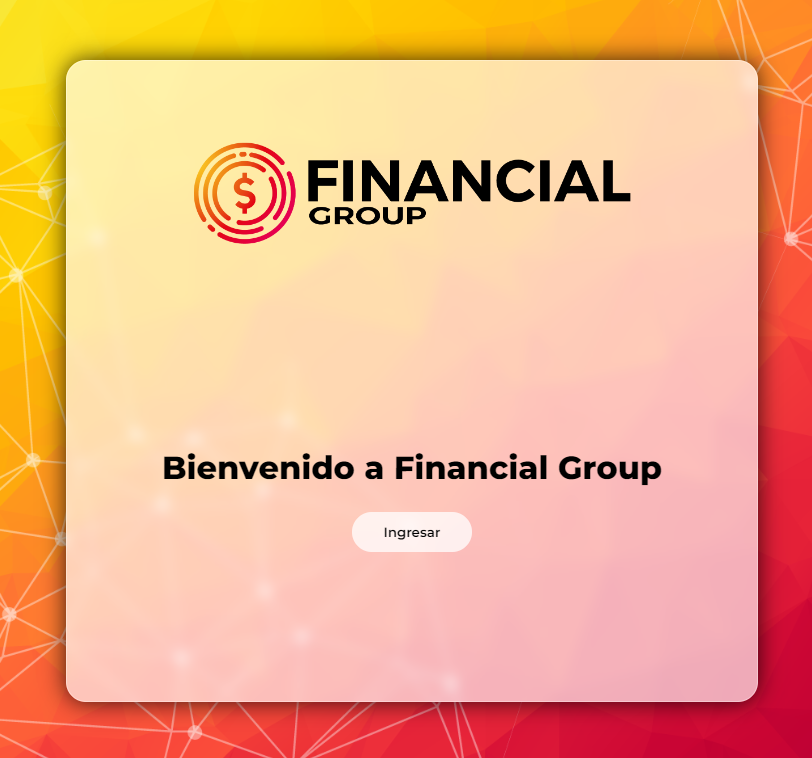
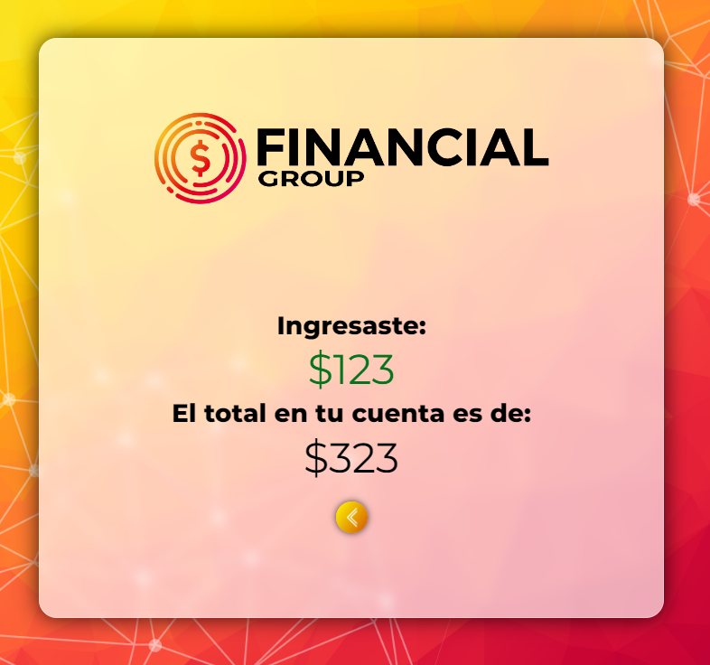

<h1 align="center">Financial Group | ATM</h1>
<h3 align="center">Como proyecto, cree un cajero con ingreso de usuario (clave 1234) y opciones de ver saldo, ingresar dinero y retirar dinero. 

<h3 align="left">Lenjuajes usados:</h3>

   
